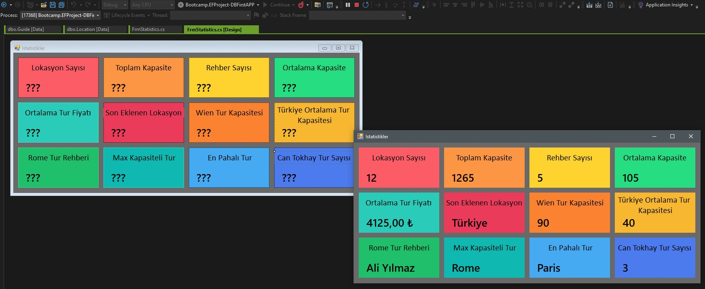

# 📘 YouTube C# Bootcamp Projects

This repository contains the projects I completed during the C# Bootcamp led by Murat Yücedağ on YouTube. Throughout this camp, I had the opportunity to revisit foundational C# concepts through practical applications, strengthening my understanding of the language. Below are the details of each project:

---

## 🌅 Project 1: Basic Objects – Hello World!
In this project, I revisited `Console.WriteLine()` to output text to the console, providing a quick refresh on the basic structure and output functions in C#.

---

## 🧮 Project 2: Variables
Here, I worked with variable types like `int`, `string`, and `double`, reinforcing fundamental concepts related to data types and variable operations for efficient use.

---

## 🔍 Project 3: Decision Structures (If-Else)
This project involved using if-else structures to control program flow based on different conditions, allowing me to explore decision-making processes in various scenarios.

---

## 🔁 Project 4: Loops
I practiced with for, while, and foreach loops, revisiting the best practices for performing repetitive tasks and managing large datasets in C#.

---

## 🔄 Project 5: Practical Applications of Loops
In this project, I created different star patterns (single row, column, squares, triangles, diamonds, pyramids) to further explore loop structures and their flexibility in generating various shapes.

---

## 🗂️ Project 6: Arrays
This project focused on using arrays to store and process multiple values, revisiting array handling and iteration methods to manage and manipulate data effectively.

---

## 📊 Project 7: Foreach Loop – Exam System
In this project, I built a simple exam system simulation using a foreach loop. The application calculates averages and evaluates pass/fail status based on student scores, utilizing loops for data analysis.

---

## 🛠️ Project 8: Methods
In the final project, I focused on creating modular and reusable code by defining methods with parameters and return values, making my code more organized and adaptable.

---

## 🌍 Project 9: Tourism Statistics Dashboard
This project involves a dynamic statistics panel for a tourism application, built using **Entity Framework (EF)**. The panel fetches real-time data such as location counts, average tour prices, and guide assignments from a relational database.

### Highlights:
- **Real-Time Data Updates**: Integrates EF methods like `Count`, `Sum`, and `Average` for efficient data processing.
- **Custom Insights**: Provides city-specific and guide-specific data through dynamic queries.
- **EF Versatility**: Demonstrates the flexibility of EF in handling diverse queries and aggregations.
- And here is a screenshot of one of most attractive window of the project. I used the EF methods that i mentioned above :

---

These projects gave me hands-on experience with essential C# concepts, setting a solid foundation for further, more complex applications. Looking forward to building upon these basics in future projects!
