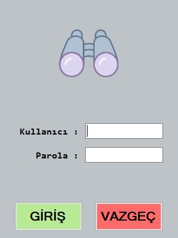

# 📘 YouTube C# Bootcamp Projects

This repository contains the projects I completed during the C# Bootcamp led by Murat Yücedağ on YouTube. Throughout this camp, I had the opportunity to revisit foundational and advanced C# concepts through practical applications, strengthening my understanding of the language. Below are the details of each module and the corresponding projects:

---

## 🏫 Bootcamp 101 & 201: Foundational C# Concepts

### 🌅 Project 1: Basic Objects – Hello World!
In this project, I revisited `Console.WriteLine()` to output text to the console, providing a quick refresh on the basic structure and output functions in C#.

---

### 🧮 Project 2: Variables
Here, I worked with variable types like `int`, `string`, and `double`, reinforcing fundamental concepts related to data types and variable operations for efficient use.

---

### 🔍 Project 3: Decision Structures (If-Else)
This project involved using if-else structures to control program flow based on different conditions, allowing me to explore decision-making processes in various scenarios.

---

### 🔁 Project 4: Loops
I practiced with for, while, and foreach loops, revisiting the best practices for performing repetitive tasks and managing large datasets in C#.

---

### 🔄 Project 5: Practical Applications of Loops
In this project, I created different star patterns (single row, column, squares, triangles, diamonds, pyramids) to further explore loop structures and their flexibility in generating various shapes.

---

### 🗂️ Project 6: Arrays
This project focused on using arrays to store and process multiple values, revisiting array handling and iteration methods to manage and manipulate data effectively.

---

### 📊 Project 7: Foreach Loop – Exam System
In this project, I built a simple exam system simulation using a foreach loop. The application calculates averages and evaluates pass/fail status based on student scores, utilizing loops for data analysis.

---

### 🛠️ Project 8: Methods
In the final project, I focused on creating modular and reusable code by defining methods with parameters and return values, making my code more organized and adaptable.

---

## 🏗️ Bootcamp 301 & 401: Advanced Concepts – OOP and EF

### 🌍 Project 9: Tourism Statistics Dashboard
This project involves a dynamic statistics panel for a tourism application, built using **Entity Framework (EF)**. The panel fetches real-time data such as location counts, average tour prices, and guide assignments from a relational database.

#### Highlights:
- **Real-Time Data Updates**: Integrates EF methods like `Count`, `Sum`, and `Average` for efficient data processing.
- **Custom Insights**: Provides city-specific and guide-specific data through dynamic queries.
- **EF Versatility**: Demonstrates the flexibility of EF in handling diverse queries and aggregations.
- And here is a screenshot of one of the most attractive windows of the project. I used the EF methods that I mentioned above:

---

### 🗃️ Project 10: CRUD Operations with Database
In this project, I created a working environment focused on performing **CRUD (Create, Read, Update, Delete)** operations using **Entity Framework** and a relational database. The project highlights efficient data management and dynamic interaction with the database.

#### Highlights:
- **Create**: Insert new records into the database using EF.
- **Read**: Fetch and display data with filtering, sorting, and pagination.
- **Update**: Modify existing records dynamically.
- **Delete**: Remove unwanted records safely and efficiently.
- **User Interface Integration**: All CRUD operations are integrated with a user-friendly interface for seamless data manipulation.
- **Performance Optimizations**: Leveraged LINQ and EF for efficient database interactions.

---

### ⚙️ Bootcamp 301 & 401 Core Concepts:
The 301 & 401 modules introduced advanced C# concepts, focusing on:
- **Object-Oriented Programming (OOP)**: Encapsulation, inheritance, polymorphism, and abstraction in C#.
- **Entity Framework (EF)**:
  - **Code First Approach**: Designing databases directly from C# classes.
  - **Database First Approach**: Generating C# models based on existing databases.
  - **Repository Design Pattern**: Implementing cleaner, reusable, and testable database operations.

---

## 🚀 Bootcamp 501: Advanced Data Access with Dapper

### 🖇️ Lightweight Data Access, Dapper
**Dapper**, a micro ORM, for lightweight and high-performance data access. The focus was on implementing efficient database interactions without the overhead of a full ORM.

#### Highlights:
- **High-Performance Queries**: Leveraged Dapper to execute SQL queries and commands efficiently.
- **Ease of Use**: Simplified mapping of database records to C# objects.
- **Flexibility**: Provided direct control over SQL queries for complex scenarios.
- **CRUD Operations**: Implemented all basic CRUD operations with clean and concise code.

And here is a screenshot of the main form from this project:

---

## 🌐 Bootcamp 601: NoSQL and Relational Databases

### 🌱 Working with MongoDB
**MongoDB**, a NoSQL database, for handling unstructured and semi-structured data. The project emphasized creating flexible and scalable solutions for modern applications.

#### Highlights:
- **NoSQL Design Principles**: Learned to design collections and documents for efficient data storage.
- **CRUD Operations**: Performed create, read, update, and delete operations using MongoDB's native drivers in C#.
- **Scalability**: Focused on using MongoDB for applications with large and dynamic datasets.

---

### 🛢️ PostgreSQL Integration
**PostgreSQL**, a relational database solution for handling structured data. It provided an opportunity to explore the strengths of PostgreSQL in enterprise-grade applications.

#### Highlights:
- **Relational Database Management**: Worked with structured data using PostgreSQL.
- **Advanced SQL Features**: Explored support for JSON, arrays, and window functions in queries.
- **Database Optimization**: Applied indexing, query tuning, and other optimizations for enhanced performance.

---

## 💼 Bootcamp Final Project: Financial CRM

### Financial CRM Overview
The **Financial CRM Project** simplifies personal finance management for users. It enables users to track banks, balances, bills, and spending, providing tools for financial analysis and management.

#### Key Features:
- 🏦 **Registered Banks and Balances**: View balances across multiple banks.
- 📑 **Bills Management**: Manage and pay bills effortlessly.
- 💸 **Expense Tracking**: Track spending and add new expenses.
- 💳 **Bank Transactions**: Filter and analyze detailed bank transactions.
- 📊 **Dashboard**: Visualize financial status, including total balance and latest transactions, using dynamic charts.
- ⚙️ **Settings**: Change user settings, including password updates.

#### Technologies Used:
- **C#**: Core programming language for the project, developed with OOP principles.
- **Entity Framework**: ORM used for managing database interactions with ease.
- **SQL Server**: Database management system for handling data storage and queries.
- **LINQ**: For efficient and readable data queries.

#### Screenshots:
**Login Page**:  

**Dashboard**:  

**Bank Transactions**:  

---

These projects gave me hands-on experience with foundational, advanced, and modern data access techniques in C#. From traditional relational database approaches with EF and PostgreSQL to lightweight access with Dapper and scalable NoSQL solutions with MongoDB, I’ve built a comprehensive skill set ready for diverse application development.
